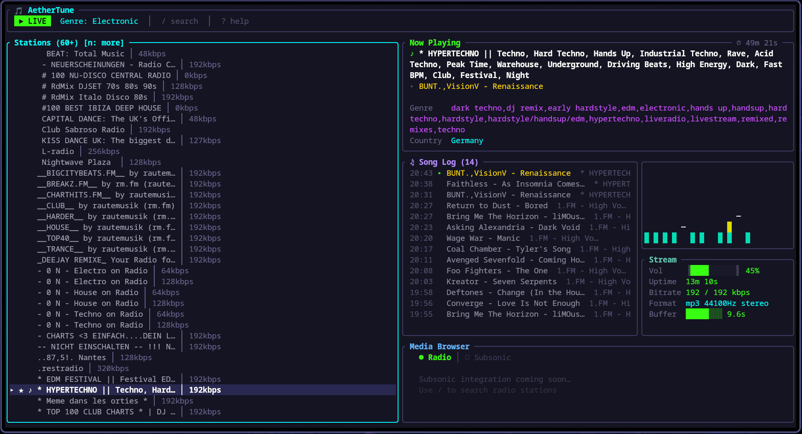

# AetherTune

A terminal-based internet radio player with real-time audio visualization, built in Rust.


## Overview

AetherTune is a TUI (terminal user interface) application that lets you browse, search, and stream internet radio stations directly from your terminal. It features a real-time spectrum visualizer driven by actual audio analysis, a rolling song log that captures ICY metadata, and live stream health monitoring.



## Requirements

- **Rust** 1.85+ (edition 2024)
- **mpv** — audio playback backend
- **PulseAudio or PipeWire** (with PulseAudio compatibility) — for real audio visualization
  - `parec` must be available in `$PATH` (provided by `pulseaudio-utils` or `pipewire-pulse`)
- **Linux** — uses Unix domain sockets for mpv IPC, POSIX FIFOs for audio capture, and `libc` for process group management

### System dependencies (Debian/Ubuntu)

```bash
sudo apt install mpv pulseaudio-utils
```

### System dependencies (Arch)

```bash
sudo pacman -S mpv pipewire-pulse
# or: sudo pacman -S mpv pulseaudio
```

### Features

- **Station browsing** — browse thousands of stations via the RadioBrowser API, filter by genre, search by name
- **Real-time audio visualization** — 24-band spectrum analyzer using DFT on captured PCM audio via PulseAudio/PipeWire monitor
- **Song log** — automatically tracks song changes from ICY stream metadata with timestamps
- **Stream health monitor** — live bitrate (actual vs advertised), buffer status, codec info, connection uptime
- **Favorites & history** — save stations, track listening history, persisted to JSON
- **Built-in profiler** — per-frame timing breakdown for performance tuning
- **Fallback mode** — simulated visualizer when PulseAudio capture isn't available

### Optional

- Without `parec`, the app falls back to a simulated visualizer — everything else works normally.

## Installation

```bash
# Clone the repository
git clone https://github.com/nevermore23274/aethertune.git
cd aethertune

# Build in release mode
cargo build --release

# Run
./target/release/AetherTune
```

## Keybindings

Below is a list of keyboard shortcuts, however you can simply press the `h` key in order to see them as well. (`esc` closes the help menu) 

| Key | Action |
|-----|--------|
| `↑` / `↓` or `j` / `k` | Navigate station list |
| `Enter` | Play selected station |
| `s` | Stop playback |
| `+` / `-` | Volume up / down |
| `/` | Search stations |
| `f` | Toggle favorite |
| `i` | Station details overlay |
| `n` | Load more stations |
| `Tab` | Cycle panel (Stations / Favorites / History) |
| `[` / `]` | Cycle genre category |
| `?` | Help overlay |
| `` ` `` | Performance profiler |
| `<` / `>` | Adjust tick rate (when profiler is open) |
| `q` | Quit |

## Architecture

```
src/
├── main.rs                  Entry point, event loop, frame timing
├── app.rs                   App state, business logic, perf stats
├── audio/
│   ├── player.rs            mpv playback, IPC, parec capture, stream info
│   ├── pipe.rs              FIFO creation, PCM reader thread, DFT analysis
│   └── visualizer.rs        Bar animation (real + simulated modes)
├── storage/
│   ├── favorites.rs         JSON persistence for favorites
│   └── history.rs           JSON persistence for play history
└── ui/
    ├── mod.rs               Layout orchestration
    ├── helpers.rs            Color palette, shared widgets
    ├── header.rs             Top bar (LIVE indicator, genre, hints)
    ├── station_list.rs       Left panel (stations/favorites/history)
    ├── now_playing.rs        Station info + session timer
    ├── song_log.rs           Rolling ICY metadata log
    ├── visualizer.rs         Spectrum bar rendering
    ├── stream_info.rs        Live stream health panel
    ├── media_browser.rs      Media source switcher (Radio/Subsonic stub)
    ├── overlays.rs           Help + station detail popups
    └── perf_overlay.rs       Built-in performance profiler
```

### Audio visualization pipeline

When `parec` is available, AetherTune captures audio through the PulseAudio/PipeWire monitor source:

1. **mpv** plays audio normally through the default audio output
2. **parec** captures the monitor source and writes raw s16le stereo 48kHz PCM to a named FIFO
3. A background thread reads the FIFO and runs a **partial DFT with Hann windowing** across 24 logarithmically-spaced frequency bands (50Hz–18kHz)
4. Band energies and RMS are pushed to a shared `Arc<Mutex<AudioAnalysis>>`
5. The visualizer reads the analysis data each tick and applies exponential smoothing

Process isolation is handled carefully: `parec` runs in its own process group via `setsid()`, and cleanup uses `kill(-pgid, SIGTERM)` to ensure no orphaned processes.

### Data persistence

Favorites and history are stored as JSON in `~/.aethertune/`. The serializer/parser is hand-rolled (no serde dependency) to keep the dependency tree minimal.

## License

MIT
