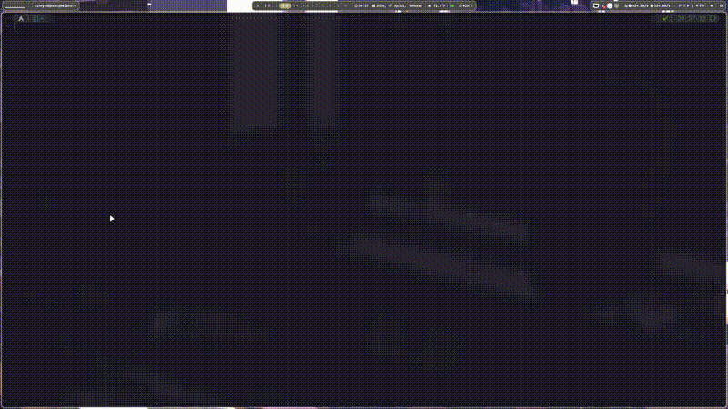

# AetherTune

A terminal-based internet radio player with real-time audio visualization, built in Rust.


[](https://github.com/nevermore23274/AetherTune/actions/workflows/release.yml)
[](https://aur.archlinux.org/packages/aethertune-bin)
[](https://launchpad.net/~patchgoblin/+archive/ubuntu/aethertune)
[](https://github.com/nevermore23274/homebrew-aethertune)

## Overview

AetherTune is a TUI (terminal user interface) application that lets you browse, search, and stream internet radio stations directly from your terminal. It features a real-time spectrum visualizer driven by actual audio analysis, a rolling song log that captures ICY metadata, and live stream health monitoring.



### Features

- **Station browsing** — browse thousands of stations via the RadioBrowser API, filter by genre, search by name. Results are sorted by popularity with broken streams and spam filtered out automatically
- **Local blending** — optionally configure your country code in Settings to blend ~30% local stations into every genre and search result, interleaved naturally with global results
- **Real-time audio visualization** — 16-band spectrum analyzer using a sliding-window radix-2 FFT (~94 updates/sec) with CAVA-inspired gravity fall-off, integral smoothing, and automatic sensitivity. On Linux, audio is captured via PulseAudio/PipeWire monitor; on Windows, via WASAPI loopback
- **Song log** — automatically tracks song changes from ICY stream metadata with timestamps
- **Stream health monitor** — live bitrate (actual vs advertised), buffer status, codec info, connection uptime
- **Favorites & history** — save stations, track listening history, persisted to JSON
- **Configurable startup panel** — choose whether AetherTune opens to Stations, Favorites, or History from the launch menu's Settings screen
- **Customizable keybindings** — remap every keyboard shortcut from the in-app settings overlay, persisted to your config
- **Color themes** — 8 built-in themes (CRT, Gruvbox, Nord, Dracula, Monokai, Catppuccin, Hacker, Solarized) with live preview, and an optional transparent background mode that works with any theme
- **Built-in profiler** — per-frame timing breakdown for performance tuning
- **Fallback mode** — simulated visualizer when audio capture isn't available (e.g. macOS, or Linux without PulseAudio)

### Optional

- Without `parec` (Linux), the app falls back to a simulated visualizer — everything else works normally.

## Installation

<details>
<summary><b>Linux — Arch (AUR)</b></summary>

```bash
paru -S aethertune-bin
```

Or with yay: `yay -S aethertune-bin`

Dependencies (`mpv`, `libpulse`) are installed automatically. For real-time audio visualization, you also need `pipewire-pulse` or `pulseaudio` (one is likely already installed).

</details>

<details>
<summary><b>Linux — Ubuntu/Debian (PPA)</b></summary>

```bash
sudo add-apt-repository ppa:patchgoblin/aethertune
sudo apt update
sudo apt install aethertune
```

Currently available for Ubuntu Noble (24.04). Dependencies (`mpv`, `libpulse0`) are installed automatically. For real-time audio visualization, you also need `pipewire-pulse` or `pulseaudio`.

</details>

<details>
<summary><b>Linux / macOS — Homebrew</b></summary>

If you don't have Homebrew, install it first from [brew.sh](https://brew.sh/).

```bash
brew tap nevermore23274/aethertune
brew install aethertune
```

This will automatically install `mpv` as a dependency. On Linux, you'll additionally need `pulseaudio-utils` (or `pipewire-pulse`) for real-time audio visualization.

> **macOS note:** Audio visualization uses a simulated mode (no real-time audio capture yet). Playback, station browsing, favorites, and all other features work normally.

</details>

<details>
<summary><b>macOS — Prebuilt binary</b></summary>

Download the latest `.tar.gz` for your architecture from the [Releases page](https://github.com/nevermore23274/AetherTune/releases):

```bash
# Apple Silicon (M1/M2/M3/M4)
curl -LO https://github.com/nevermore23274/AetherTune/releases/download/VERSION/AetherTune-VERSION-macos-aarch64.tar.gz
tar xzf AetherTune-VERSION-macos-aarch64.tar.gz
./AetherTune-VERSION-macos-aarch64/AetherTune

# Intel
curl -LO https://github.com/nevermore23274/AetherTune/releases/download/VERSION/AetherTune-VERSION-macos-x86_64.tar.gz
tar xzf AetherTune-VERSION-macos-x86_64.tar.gz
./AetherTune-VERSION-macos-x86_64/AetherTune
```

Replace `VERSION` with the actual tag (e.g. `v0.9.0`). You'll need `mpv` installed, if you have [Homebrew](https://brew.sh/): `brew install mpv`.

> **macOS note:** Audio visualization uses a simulated mode. Playback and all other features work normally.

</details>

<details>
<summary><b>Linux — Prebuilt binary</b></summary>

Download the latest `.tar.gz` from the [Releases page](https://github.com/nevermore23274/AetherTune/releases):

```bash
curl -LO https://github.com/nevermore23274/AetherTune/releases/download/VERSION/AetherTune-VERSION-linux-x86_64.tar.gz
tar xzf AetherTune-VERSION-linux-x86_64.tar.gz
./AetherTune-VERSION-linux-x86_64/AetherTune
```

Replace `VERSION` with the actual tag (e.g. `v0.9.0`). You'll need `mpv` and `parec` installed on your system.

</details>

<details>
<summary><b>Nix / Flakes</b></summary>

If you use Nix with flakes enabled, you can run AetherTune directly:

```bash
nix run github:nevermore23274/AetherTune
```

To install permanently, add the flake input to your `flake.nix`:

```nix
inputs.AetherTune.url = "github:nevermore23274/AetherTune";
```

Then add the package to your system or user packages:

```nix
# NixOS (configuration.nix)
environment.systemPackages = [ inputs.AetherTune.packages.${system}.aethertune ];

# Home Manager
home.packages = [ inputs.AetherTune.packages.${system}.aethertune ];
```

</details>

<details>
<summary><b>Linux / macOS — From source</b></summary>

Requires Rust 1.85+ and `mpv`. On Linux, you'll also need `pulseaudio-utils` or `pipewire-pulse` for real-time audio visualization.

```bash
git clone https://github.com/nevermore23274/aethertune.git
cd aethertune
cargo build --release
./target/release/AetherTune
```

</details>

<details>
<summary><b>Windows</b></summary>

Download the latest `.zip` from the [Releases page](https://github.com/nevermore23274/AetherTune/releases). The zip includes `AetherTune.exe` and `mpv.exe` bundled together — no separate installation needed.

1. Extract the zip to a folder
2. Open **Windows Terminal** (recommended) and navigate to the folder
3. Run `AetherTune.exe`

Real-time audio visualization works out of the box via WASAPI loopback capture — no additional software is needed. The visualizer captures whatever is playing through your default audio output device.

> **Note:** For the best experience, use [Windows Terminal](https://aka.ms/terminal) rather than cmd.exe. The legacy console has limited support for keyboard input and ANSI rendering that TUI apps rely on.

</details>

<details>
<summary><b>All platforms — cargo install</b></summary>

If you have Rust installed, you can install directly from GitHub:

```bash
cargo install --git https://github.com/nevermore23274/AetherTune
```

This builds and installs the `AetherTune` binary to `~/.cargo/bin/`. Make sure `mpv` is available on your system.

</details>

## Usage

```bash
# Run normally (with CRT boot animation)
aethertune

# Skip the launch menu
aethertune --skip-menu

# Adjust boot animation speed (fast, normal, slow, off)
aethertune --boot-speed=fast

# Store config.json, favorites.json, and history.json somewhere other
# than the default ~/.aethertune — e.g. for XDG-style layouts or dotfile tracking
aethertune --config-dir=$HOME/.config/aethertune
```

> On Windows, run `AetherTune.exe` from Windows Terminal. If installed from source on Linux, use `./target/release/AetherTune`.

You can set the same storage location via the `AETHERTUNE_CONFIG_DIR` environment variable instead of passing `--config-dir` every time — useful if you'd rather set it once in your shell profile. The flag takes priority if both are set. Either way, the directory is created automatically if it doesn't exist; the default remains `$HOME/.aethertune` (`$USERPROFILE\.aethertune` on Windows) unless overridden.

## Keybindings (Defaults)

Below is a list of default keyboard shortcuts. All keybindings can be remapped from the settings overlay (`S`). Press `?` in the app to see your current bindings (`Esc` closes the overlay).

| Key                    | Action                                       |
| ---------------------- | -------------------------------------------- |
| `↑` / `↓` or `j` / `k` | Navigate station list                        |
| `Enter`                | Play selected station                        |
| `s`                    | Stop playback                                |
| `+` / `-`              | Volume up / down                             |
| `/`                    | Search stations                              |
| `f`                    | Toggle favorite                              |
| `i`                    | Station details overlay                      |
| `n`                    | Load more stations                           |
| `Tab`                  | Cycle panel (Stations / Favorites / History) |
| `[` / `]`              | Cycle genre category                         |
| `Shift+Tab`            | Cycle genre category (backward)              |
| `g`                    | Genre picker overlay                         |
| `t`                    | Theme picker overlay                         |
| `v`                    | Toggle visualizer on/off                     |
| `?`                    | Help overlay                                 |
| `S`                    | Customize keybindings                        |
| `` ` ``                | Performance profiler                         |
| `<` / `>`              | Adjust tick rate (when profiler is open)      |
| `{` / `}`              | Adjust visualizer smoothing (when profiler is open) |
| `q`                    | Quit                                         |

## Settings

AetherTune has a settings screen accessible from the launch menu, and a keybinding settings overlay accessible during playback. Settings are persisted to `~/.aethertune/config.json` by default — see [Usage](#usage) for how to store it elsewhere.

### Country Code

Set a two-letter ISO 3166-1 Alpha-2 country code (e.g. `US`, `DE`, `GB`, `JP`) to blend local stations into your results. You can find your country code in the [full list on Wikipedia](https://en.wikipedia.org/wiki/ISO_3166-1_alpha-2#Officially_assigned_code_elements). When configured, roughly 30% of stations in each genre and search result will come from your country, interleaved naturally with global results sorted by popularity.

To configure: launch AetherTune → select **Settings** from the menu → type your two-letter country code → press **Enter** to save.

Leave the country code empty (backspace to clear) for pure global results — this is the default.

### Default Panel

Choose which panel AetherTune opens to on launch: **Stations**, **Favorites**, or **History**. Useful if you mostly return to a curated favorites list rather than browsing fresh stations each time.

To configure: launch AetherTune → select **Settings** from the menu → use **◂/▸** on the "Default Panel" field to cycle through the options → press **Enter** to save.

The Stations tab is still preloaded with a Lo-fi station list in the background regardless of your default panel, so it's ready the moment you switch to it.

### Keybindings

Every keyboard shortcut can be remapped. Press `S` during normal playback to open the keybinding settings overlay.

In the overlay:
- **↑/↓** — navigate the action list
- **Enter** — rebind the primary key (press any key to assign)
- **a** — rebind the alternate key
- **d** — clear the alternate key
- **r** — reset a single action to its default
- **R** — reset all keybindings to defaults
- **Esc** or **S** — close the overlay

Each action supports a primary key and an optional alternate key. Changes are saved immediately to `config.json` and the help overlay (`?`) always reflects your current bindings. The header bar hints also update dynamically.

Only non-default keybindings are written to the config file to keep it clean. A fresh config with customized bindings looks like:

```json
{
  "tick_rate_ms": 30,
  "volume": 50,
  "country_code": "US",
  "theme": "CRT",
  "visualizer_enabled": true,
  "default_panel": "Favorites",
  "transparent_bg": false,
  "keybindings": {
      "quit": ["x"],
      "search": ["Space"]
  }
}
```

### Themes

Press `t` to open the theme picker. AetherTune ships with 8 built-in themes:

- **CRT** — the default phosphor terminal aesthetic (cyan/magenta/neon green)
- **Gruvbox** — warm retro palette
- **Nord** — cool arctic blues
- **Dracula** — dark purple
- **Monokai** — classic editor colors
- **Catppuccin** — pastel dark
- **Hacker** — green-on-black matrix style
- **Solarized** — precision colors for readability

Themes apply to the player UI only (not the launcher or exit animation). Your selection is persisted to `~/.aethertune/config.json`. The theme picker shows live color swatches and previews each theme as you navigate.

In the picker:
- **↑/↓** — navigate themes (each one live-previews as you move)
- **Enter** — apply the selected theme and close
- **b** — toggle transparent background
- **Esc** — close (the live-previewed theme stays applied)

**Transparent background** clears the player UI's panel backgrounds so your terminal emulator's own background shows through — including its transparency, if the terminal supports it (e.g. kitty, alacritty, WezTerm). It works with any of the 8 themes rather than being tied to one, toggles and persists immediately, and is saved to `config.json` independently of your theme choice. Selected/highlighted rows keep a solid background so they stay readable against a transparent terminal, and the effect is scoped to the player UI panels — overlays, the launch menu, and the boot/shutdown animations always keep their own fixed background.

## Architecture

```
src/
├── main.rs                   Event loop skeleton, terminal setup/teardown
├── core/
│   ├── app.rs                App struct, construction, core methods
│   ├── types.rs              InputMode, ActivePanel, Overlay, QueryKind, NowPlaying, SongLogEntry
│   ├── radio.rs              RadioBrowser API: fetch, search, pagination, spam filtering
│   └── perf.rs               PerfStats, FrameTiming, PerfSummary
├── input/
│   └── handler.rs            Keybinding dispatch (normal, editing, overlays)
├── audio/
│   ├── player.rs             mpv playback, IPC, platform-specific capture orchestration
│   ├── pipe.rs               FIFO creation, PCM reader thread (Unix)
│   ├── fft.rs                In-place radix-2 FFT, band grouping, perceptual weighting
│   ├── seqlock.rs            Generic lock-free SeqLock<T: Copy>
│   ├── visualizer.rs         Bar animation (CAVA-style real + simulated modes)
│   ├── wasapi_capture.rs     WASAPI loopback audio capture (Windows)
│   └── jobobject.rs          Win32 Job Object for mpv lifecycle (Windows)
├── storage/
│   ├── config.rs             User preferences (tick rate, volume, country code, keybindings)
│   ├── favorites.rs          JSON persistence for favorites
│   ├── history.rs            JSON persistence for play history
│   └── paths.rs              Resolves the storage directory (--config-dir / AETHERTUNE_CONFIG_DIR / default)
└── ui/
    ├── mod.rs                Layout orchestration
    ├── helpers.rs            Color palette, shared widgets
    ├── launcher.rs           CRT boot animation, start menu, settings screen
    ├── header.rs             Top bar (LIVE indicator, genre, hints)
    ├── station_list.rs       Left panel (stations/favorites/history)
    ├── now_playing.rs        Station info + session timer
    ├── song_log.rs           Rolling ICY metadata log
    ├── visualizer.rs         Spectrum bar rendering (proportional sizing for any resolution)
    ├── stream_info.rs        Live stream health panel
    ├── media_browser.rs      Media source switcher (Radio/Subsonic stub)
    ├── overlays.rs           Help + station detail popups
    ├── genre_picker.rs       Genre selection overlay
    ├── theme_picker.rs       Theme selection overlay
    ├── themes.rs             Color theme definitions (8 built-in themes)
    ├── settings.rs           Keybinding settings overlay
    ├── shutdown.rs           CRT power-off animation on quit
    └── perf_overlay.rs       Built-in performance profiler
```

### Audio visualization pipeline

AetherTune captures real audio for visualization on both Linux and Windows. The platform-specific capture feeds into a shared FFT and visualization pipeline.

**Linux (PulseAudio/PipeWire):** `mpv` plays audio normally. `parec` captures the monitor source and writes raw s16le stereo 48kHz PCM to a named FIFO. A background thread reads the FIFO using a sliding window.

**Windows (WASAPI):** `mpv` plays audio normally. A background thread opens the default output device in WASAPI loopback mode and reads whatever is playing through the speakers. No external tools or user configuration needed as WASAPI is built into Windows since Vista.

**Shared pipeline (both platforms):** 512 new samples (~10.7ms) are shifted into a 1024-sample buffer, then an in-place radix-2 Cooley-Tukey FFT with Hann windowing produces ~94 updates/sec. The 512 frequency bins are grouped into 16 logarithmically-spaced bands (50Hz–10kHz) with perceptual weighting. FFT buffers, window coefficients, and band edges are all pre-allocated at thread startup for zero per-frame heap allocation.

Band energies and RMS are published via a lock-free sequence lock (`SeqLock<AudioAnalysis>`). The reader thread writes without blocking, and the render thread always reads the latest consistent snapshot with no contention.

The visualizer applies CAVA-inspired post-processing: gravity fall-off (accelerating drop), integral smoothing (weighted running average), and automatic sensitivity adjustment.

**macOS:** Falls back to a simulated visualizer (animated based on audio activity detected via mpv IPC). Real-time capture is not yet implemented.

**Process management:** On Linux, `parec` runs in its own process group via `setsid()`, and cleanup uses `kill(-pgid, SIGTERM)` to ensure no orphaned processes. On Windows, `mpv.exe` is assigned to a Win32 Job Object with `JOB_OBJECT_LIMIT_KILL_ON_JOB_CLOSE`, ensuring it is terminated automatically when AetherTune exits, even on crash or forced close.

### Data persistence

Favorites, history, and user preferences (tick rate, volume, country code, default panel, theme, transparent background, keybindings) are stored as JSON in `~/.aethertune/` by default, or wherever `--config-dir`/`AETHERTUNE_CONFIG_DIR` points (see [Usage](#usage)). The serializer/parser is hand-rolled (no serde dependency) to keep the dependency tree minimal. Settings like tick rate and keybindings are saved automatically when adjusted and restored on next launch. The country code and default panel are configured via the Settings screen in the launch menu. Only non-default keybindings are persisted to keep the config file clean.

## Contributing

See [docs/CONTRIBUTING.md](docs/CONTRIBUTING.md) for build instructions, project structure, and how to submit PRs.

## Performance Tuning

AetherTune has a built-in per-frame profiler. See [docs/PROFILING.md](docs/PROFILING.md) for how to read the profiler and tune performance for your system.

## License

MIT